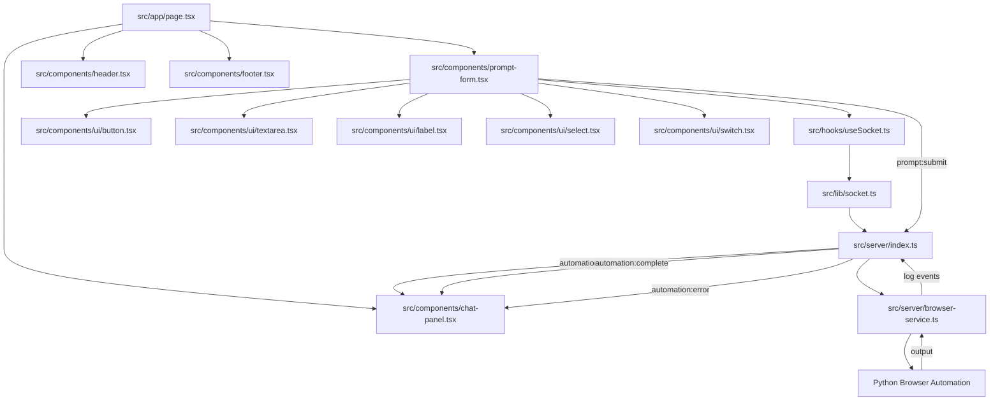

# OpenManus Architecture

## Overview

OpenManus is built with a modern web architecture that combines React for the frontend and Node.js/Python for the backend, using WebSocket for real-time communication.

## Data Flow Diagram



## Dependency Chains

### 1. Frontend UI Chain
```
page.tsx
├── prompt-form.tsx
│   ├── button.tsx
│   ├── textarea.tsx
│   ├── label.tsx
│   ├── select.tsx
│   └── switch.tsx
├── chat-panel.tsx
├── header.tsx
└── footer.tsx
```

### 2. Socket Communication Chain
```
prompt-form.tsx
├── useSocket.ts
│   └── socket.ts
        └── socket.io-client
```

### 3. Backend Processing Chain
```
server/index.ts
├── socket.io
├── browser-service.ts
│   ├── child_process (spawn)
│   └── events (EventEmitter)
└── utils/logger.ts
```

### 4. Data Flow Chain
```
User Input
└── prompt-form.tsx
    └── Socket Event (prompt:submit)
        └── server/index.ts
            └── browser-service.ts
                └── Python Process
                    └── Browser Automation
                        └── Results
                            └── Socket Events
                                └── chat-panel.tsx
```

## Event Flow Details

### 1. User Input
- User enters prompt in prompt-form.tsx
- Configures options (model, headless, etc.)
- Clicks submit button

### 2. Frontend Processing
- prompt-form.tsx validates input
- Emits 'prompt:submit' event with options
- Updates UI loading state

### 3. Backend Processing
- server/index.ts receives event
- Creates/uses BrowserUseService instance
- Passes configuration to automation

### 4. Automation Flow
- browser-service.ts spawns Python process
- Monitors process output
- Emits progress events

### 5. Response Flow
Server emits events:
- automation:log (progress updates)
- automation:complete (success)
- automation:error (failures)
Frontend components update based on events

### 6. UI Updates
- chat-panel.tsx displays messages
- prompt-form.tsx updates loading state
- Error handling shows notifications

## Component Dependencies

Dependencies between components are managed through:
- Props for React components
- Socket events for client-server communication
- EventEmitter for backend service communication
- File system for Python process interaction

## Architecture Benefits

This architecture provides:
- Decoupled frontend and backend
- Real-time updates through WebSocket
- Extensible automation options
- Robust error handling
- Clear separation of concerns

## Key Files and Their Roles

### Frontend
- `src/app/page.tsx`: Main application page
- `src/components/prompt-form.tsx`: Form for user input and configuration
- `src/components/chat-panel.tsx`: Displays automation progress
- `src/hooks/useSocket.ts`: WebSocket connection management

### Backend
- `src/server/index.ts`: WebSocket server and request handling
- `src/server/browser-service.ts`: Browser automation service
- `src/server/utils/logger.ts`: Logging utilities

## Configuration Management

The application configuration flows through multiple layers:
1. Frontend form inputs
2. WebSocket event payload
3. Backend service configuration
4. Python process arguments

Each layer validates and processes the configuration appropriately, ensuring type safety and proper defaults.
